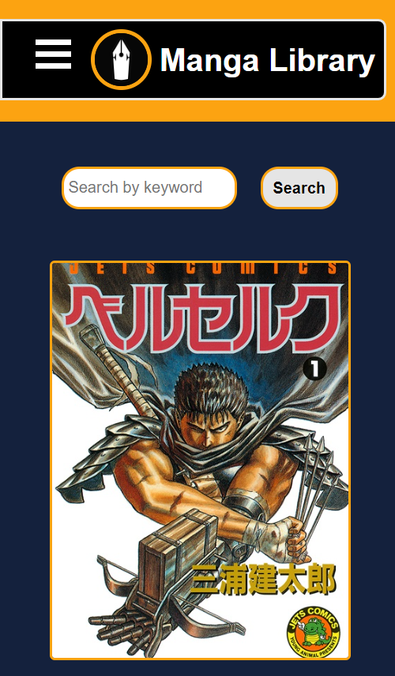
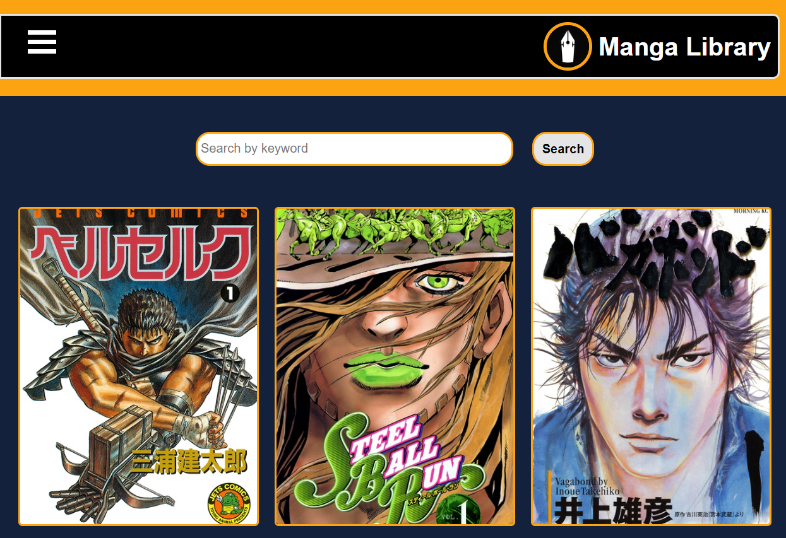
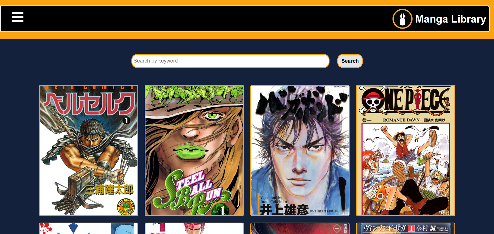
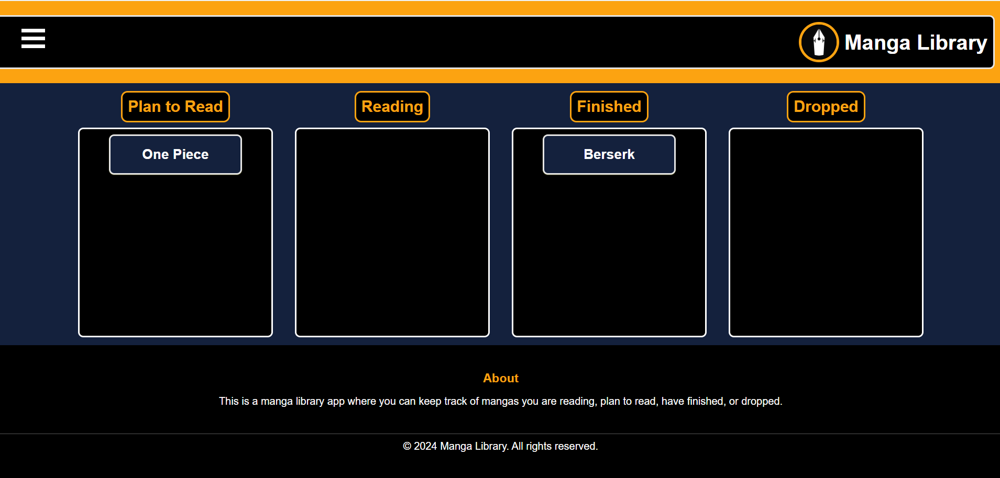
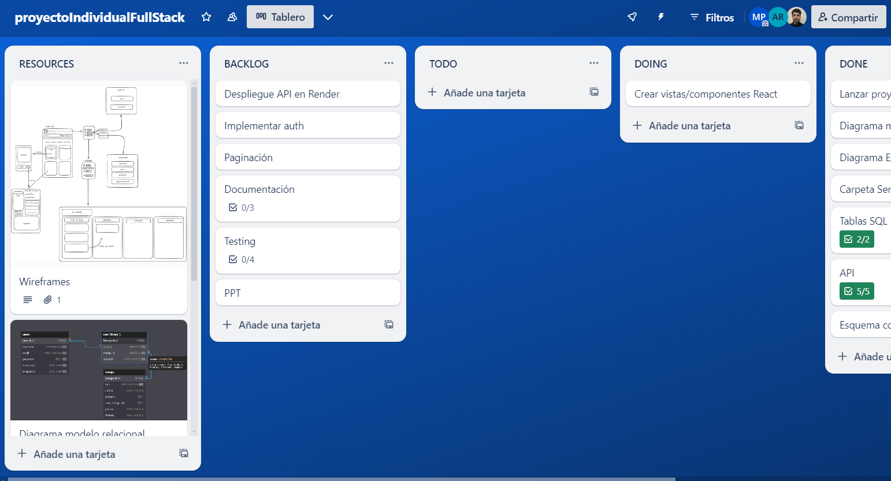
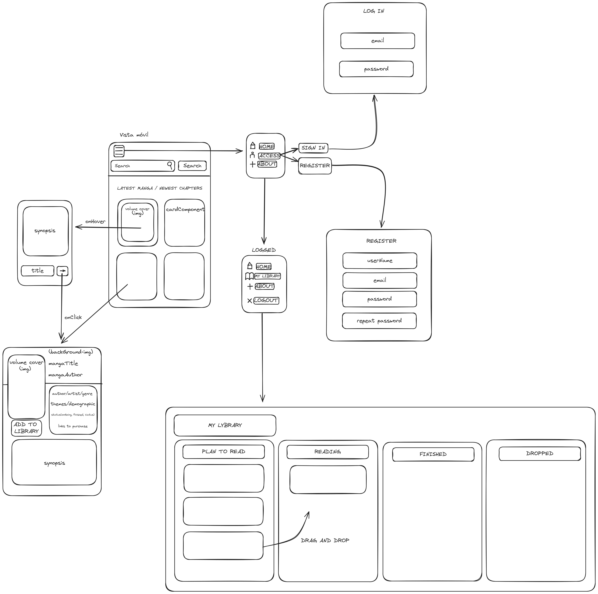

# Manga Library App

## Table of Contents
- [Description of the Project](#description-of-the-project)
- [Mobile First](#mobile-first)
- [Technologies Used](#technologies-used)
- [Objectives](#objectives)
- [Organization](#organization)
- [Product Design](#product-design)
- [Database Structure](#database-structure)
- [Features](#features)
- [Project Structure](#project-structure)

## Description of the Project
Manga Library is an interactive web application that allows users to register, log in, and manage their manga reading progress. Users can add manga to their library, categorize them into different statuses, and track their progress over time.

## Mobile First
Our application is designed to be responsive and adapt to different screen sizes, including mobile devices, tablets, and desktop screens, as shown in the images below:

- **Mobile View**:



- **Tablet View**:



- **Desktop View**:



- **Library**



## Technologies Used
- HTML
- CSS
- JavaScript
- React
- NodeJs
- PostgreSQL
- Express
- Back Libraries/Packages
    - Morgan
    - Nodemon
    - Bcrypt
    - Dotenv
    - Jsonwebtoken
- Front Libraries
    - Sass
    - hello-pangea/dnd
    - Axios
    - js-Cookies
    - React Router Dom
    - React Debounce Input
    - UUID

## Objectives
- ✅ **Frontend Design:** Responsive, mobile-first design using HTML5 semantics
- ✅ **State Management:** Efficient state management using React hooks and context API
- ✅ **API Integration:** Integration with external Jikan API for manga data
- ✅ **Database Management:** PostgreSQL for user and library data storage
- ✅ **Authentication:** Secure user authentication using JWT and Bcrypt
- ✅ **Drag and Drop:** Implement drag and drop functionality to update manga status

## Organization
- Trello for project management



- GitHub for version control


## Product Design
### Product Design


## Database Structure
### E/R Diagram


## Features
- User authentication and session management
- Add manga to library
- Categorize manga into different statuses: Plan to Read, Reading, Finished, Dropped
- Drag and drop functionality to update manga status
- Responsive design

## Project Structure
```bash
├── client
│   ├── public
│   ├── src
│   │   ├── assets
│   │   ├── components
│   │   ├── context
│   │   ├── services
│   │   ├── styles
│   │   └── App.js
│   └── package.json
├── config
├── controllers
├── middlewares
├── models
├── node_modules
├── queries
├── routes
├── .env
├── .gitignore
├── index.js
├── package-lock.json
├── package.json
├── queries.sql
├── reactStructure.txt
└── README.md

